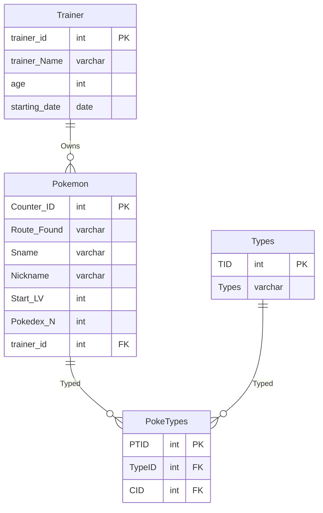

# CS Database Final by Madelynn Blackmer

## Overview
### This is a database that will be used for Pokémon Nuzlockes. This can be used for multiple people or even for one person across multiple Pokémon games. With a Pokémon table to hold most basic info needed about the Pokémon captured. One table to show off all the types; With one to connect the Pokémon to the typing charts. And finally, one to hold all basic information on the person's trainer character. Describing how the database will be used from a user’s perspective.

## Users View
### In the eyes of the view this will just make things easier. This is shown in the fact that all the Pokémon the have and which routes they have already captured their one Pokémon. Which will overall make things easier to keep track of. Outside of that it will make things easier through the fact that if the person has multiple Nuzlockes going on they can keep those multiple playthroughs on the same database whist keeping them separate from each other.

---
## Database ER Model

## Design Description
The database has four tables: Pokemon, Trainer, Types, and PokeTypes. Each table holds specific information that contributes to the database. Pokemon represents the Pokemon captured during then Nuzlocke; Trainer represents the persons player character and by extension their save file on a Nuzlocke; Types holds all the types Pokemon could possibly have; PokeTypes connects both Pokemon and Types. Keeping these tables, separate helps hold up the normalization standard. PokeTypes table exist because Pokemon can have one or two types and doing things this way is both easier and doesn't go against the basic rule of a column not being able to have mutiple values in one row. Another thing is keeping Trainer separate because it prevent the storage and typing of repetitive information and unnecessary storage use. Describe the purpose of each table in your database.


*Pokemon*
Stores all information for the pokemon collected during a Nuzlocke. It holds where it was found, it's species name, it's nickname you give it, the level you caught it at and it's pokedex number. All pokemon connect to both someone in the trainer table and to the PokeTypes table which further connects to types.


*Trainer*
Stores all information about your trainer during a Nuzlocke. It holds the characters name, age, and the starting date of when you started your Nuzlocke. All Pokemon must be connected to one of these


*Types*
Stores all the types that exist in pokemon that a pokemon might have. it connects to the PokeTypes table which further connects to the pokemon table.

*PokeTypes*
The connector table between Pokemon and Types. This purely exist to keep normalization.

---
## Creating Tables
```sql
-- ==========================================
-- Trainer Table
-- Stores information of the player characters
-- ==========================================
CREATE TABLE `Trainer` (
  `trainer_id` int(3) NOT NULL,
  `trainer_Name` varchar(50) NOT NULL,
  `age` int(2) NOT NULL,
  `starting_date` date DEFAULT NULL,
  PRIMARY KEY (`trainer_id`)
) ENGINE=InnoDB;

-- ==========================================
-- Pokemon Table
-- Holds information about the pokemon captured during the journey
-- ==========================================
CREATE TABLE `Pokemon` (
  `Counter_ID` int(11) NOT NULL AUTO_INCREMENT,
  `Route_Found` varchar(50) NOT NULL,
  `Sname` varchar(50) NOT NULL,
  `Nickname` varchar(50) DEFAULT NULL,
  `Start_LV` int(3) DEFAULT NULL,
  `Pokedex_N` int(3) NOT NULL,
  `trainer_id` int(3) NOT NULL,
  PRIMARY KEY (`Counter_ID`),
  KEY `fk_TID` (`trainer_id`),
  CONSTRAINT `fk_TID` FOREIGN KEY (`trainer_id`) REFERENCES `Trainer` (`trainer_id`) ON DELETE NO ACTION ON UPDATE NO ACTION
) ENGINE=InnoDB

-- ==========================================
-- Types
-- Gives a table of the possible types a pokemon can be
-- ==========================================
CREATE TABLE `Types` (
  `TID` int(2) NOT NULL,
  `Types` varchar(20) NOT NULL,
  PRIMARY KEY (`TID`)
) ENGINE=InnoDB

-- ==========================================
-- PokeTypes
-- A table to show off the one or two types a pokemon has
-- ==========================================
CREATE TABLE `PokeType` (
  `PTID` int(11) NOT NULL AUTO_INCREMENT,
  `TypeID` int(11) NOT NULL,
  `CID` int(11) NOT NULL,
  PRIMARY KEY (`PTID`),
  KEY `fk_TypeID` (`TypeID`),
  KEY `fk_CID` (`CID`),
  CONSTRAINT `fk_CID` FOREIGN KEY (`CID`) REFERENCES `Pokemon` (`Counter_ID`) ON DELETE NO ACTION ON UPDATE NO ACTION,
  CONSTRAINT `fk_TypeID` FOREIGN KEY (`TypeID`) REFERENCES `Types` (`TID`) ON DELETE NO ACTION ON UPDATE NO ACTION
) ENGINE=InnoDB

```

## Insert Data
### This is the sql insert data for Trainer(x21), Pokemon(x17), Types(x18), and PokeTypes(x29)

```sql
-------------------------------------------------------
-- Trainer Sample Data (21 rows)
-------------------------------------------------------
INSERT INTO `Trainer` VALUES
(11,'Jodi',16,'2024-02-10'),
(101,'Lilly',13,'2025-10-15'),
(112,'Lincoln',12,'2025-04-07'),
(140,'Rebecka',12,'2025-09-02'),
(153,'Stella',12,'2024-12-25'),
(166,'Nick M',17,'2023-07-20'),
(174,'Jacob',13,'2024-01-13'),
(183,'Megan',13,'2024-10-15'),
(233,'Lewis',16,'2024-07-16'),
(245,'Nick',15,'2025-11-12'),
(340,'Shadrack',15,'2025-01-12'),
(367,'Glory',14,'2025-12-03'),
(454,'Asher',12,'2025-01-18'),
(523,'Decka',12,'2025-04-16'),
(654,'Anna May',15,'2025-09-16'),
(664,'Marquise',11,'2025-07-20'),
(757,'Abraham',15,'2025-06-17'),
(877,'Candrew',11,'2025-11-22'),
(909,'Jessy',11,'2025-11-13'),
(986,'Ander',14,'2024-03-17'),
(993,'Kori',14,'2024-03-17');
-------------------------------------------------------
-- Pokemon Sample Data (17 rows)
-------------------------------------------------------
INSERT INTO `Pokemon` VALUES
(1,'Route 101','Eevee','Bubbles',5,133,11),
(2,'Route 104','Pidgey','LittlePeak',3,16,909),
(3,'Route 101','Pidgey','Grape',2,16,112),
(4,'Route 132','Butterfree','Ash',25,12,367),
(5,'Route 152','Houndoom','PeanutButter',55,229,112),
(6,'Route 123','Abra','DodgeNMiss',14,63,993),
(7,'Route 101','Houndour','LeBite',3,228,367),
(8,'Route 145','Bulbasaur','LivingLeaf',43,1,340),
(9,'Route 231','Vulpix','Foxy',43,37,166),
(10,'Ruggs Trail','Oddish','Henry',17,43,664),
(11,'Route 124','Horsea','Fluttershy',30,116,523),
(12,'Victory Road','Aggron','Hobo',78,306,233),
(13,'Route 212','Ralts','BowlCut',31,280,101),
(14,'Route 101','Caterpie','StringyBoi',2,10,877),
(15,'Ruggs Trail','Taillow','PeakYoEyes',15,276,454),
(16,'Victory Road','Metagross','LivinBomb',76,376,986),
(17,'Route 123','Starly','FlyTM',21,396,153);
-------------------------------------------------------
-- Types Sample Data (18 rows)
-------------------------------------------------------
INSERT INTO `Types` VALUES
(1,'Poison'),
(2,'Flying'),
(3,'Water'),
(4,'Grass'),
(5,'Fire'),
(6,'Fighting'),
(7,'Ghost'),
(8,'Dragon'),
(9,'Fairy'),
(10,'Normal'),
(11,'Bug'),
(12,'Dark'),
(13,'Ice'),
(14,'Steel'),
(15,'Rock'),
(16,'Psychic'),
(17,'Ground'),
(18,'Electric');
-------------------------------------------------------
-- PokeTypes (29 rows)
-------------------------------------------------------
INSERT INTO `PokeType` VALUES
(1,10,1),
(2,10,2),
(3,2,2),
(4,10,3),
(5,2,3),
(6,11,4),
(7,2,4),
(8,11,5),
(9,2,5),
(10,16,6),
(11,12,7),
(12,5,7),
(13,1,8),
(14,4,8),
(15,5,9),
(16,1,10),
(17,4,10),
(18,3,11),
(19,15,12),
(20,14,12),
(21,16,13),
(22,9,13),
(23,11,14),
(24,2,15),
(25,10,15),
(26,16,16),
(27,14,16),
(28,2,17),
(29,10,17);
```
---
## Queries
### Query 1 – `SELECT` with `ORDER BY` on two columns

Orders the Trainer table so it requires it 

```sql
-- Query 1: : List Trainers ordered by age, then by name. It is useful to find out the range of ages in alphabetical order.

SELECT
  trainer_id,
  trainer_Name,
  age,
  starting_date
FROM Trainer
ORDER BY age ASC, trainer_Name ASC;
```
**Sample Code**
```code
+------------+--------------+-----+---------------+
| trainer_id | trainer_Name | age | starting_date |
+------------+--------------+-----+---------------+
|        877 | Candrew      |  11 | 2025-11-22    |
|        909 | Jessy        |  11 | 2025-11-13    |
|        664 | Marquise     |  11 | 2025-07-20    |
|        454 | Asher        |  12 | 2025-01-18    |
|        523 | Decka        |  12 | 2025-04-16    |
|        112 | Lincoln      |  12 | 2025-04-07    |
|        140 | Rebecka      |  12 | 2025-09-02    |
|        153 | Stella       |  12 | 2024-12-25    |
|        174 | Jacob        |  13 | 2024-01-13    |
|        101 | Lilly        |  13 | 2025-10-15    |
|        183 | Megan        |  13 | 2024-10-15    |
|        986 | Ander        |  14 | 2024-03-17    |
|        367 | Glory        |  14 | 2025-12-03    |
|        993 | Kori         |  14 | 2024-03-17    |
|        757 | Abraham      |  15 | 2025-06-17    |
|        654 | Anna May     |  15 | 2025-09-16    |
|        245 | Nick         |  15 | 2025-11-12    |
|        340 | Shadrack     |  15 | 2025-01-12    |
|         11 | Jodi         |  16 | 2024-02-10    |
|        233 | Lewis        |  16 | 2024-07-16    |
|        166 | Nick M       |  17 | 2023-07-20    |
+------------+--------------+-----+---------------+
21 rows in set (0.002 sec)
```
---

### Query 2 – `SELECT` with a calculated field (non-aggregate)
Query 2: This query shows all the trainers ages doubled. Because it might be fun to use when you're bored.
```sql
-- Show ages and those ages doubled
SELECT
  trainer_id,
  trainer_Name,
  age,
  age * 2 AS Doubled_Age
FROM Trainer;
```

**Sample Output**
```code
+------------+--------------+-----+-------------+
| trainer_id | trainer_Name | age | Doubled_Age |
+------------+--------------+-----+-------------+
|         11 | Jodi         |  16 |          32 |
|        101 | Lilly        |  13 |          26 |
|        112 | Lincoln      |  12 |          24 |
|        140 | Rebecka      |  12 |          24 |
|        153 | Stella       |  12 |          24 |
|        166 | Nick M       |  17 |          34 |
|        174 | Jacob        |  13 |          26 |
|        183 | Megan        |  13 |          26 |
|        233 | Lewis        |  16 |          32 |
|        245 | Nick         |  15 |          30 |
|        340 | Shadrack     |  15 |          30 |
|        367 | Glory        |  14 |          28 |
|        454 | Asher        |  12 |          24 |
|        523 | Decka        |  12 |          24 |
|        654 | Anna May     |  15 |          30 |
|        664 | Marquise     |  11 |          22 |
|        757 | Abraham      |  15 |          30 |
|        877 | Candrew      |  11 |          22 |
|        909 | Jessy        |  11 |          22 |
|        986 | Ander        |  14 |          28 |
|        993 | Kori         |  14 |          28 |
+------------+--------------+-----+-------------+
21 rows in set (0.001 sec)
```
---
### Query 3 – `SELECT` using a MariaDB function (non-aggregate)
Query 3: This query extracts the first letter from each pokemon's nickname using LEFT. It's useful if you ever need to use just the first letter of a pokemon's nickname 

```sql
-- Extract the first letter of each pokemon nickname
SELECT
  Counter_ID,
  Sname,
  Nickname,
  LEFT(Nickname, 1)
FROM Pokemon
ORDER BY Counter_ID;
```
**Sample Output**
```code
+------------+------------+--------------+-------------------+
| Counter_ID | Sname      | Nickname     | LEFT(Nickname, 1) |
+------------+------------+--------------+-------------------+
|          1 | Eevee      | Bubbles      | B                 |
|          2 | Pidgey     | LittlePeak   | L                 |
|          3 | Pidgey     | Grape        | G                 |
|          4 | Butterfree | Ash          | A                 |
|          5 | Houndoom   | PeanutButter | P                 |
|          6 | Abra       | DodgeNMiss   | D                 |
|          7 | Houndour   | LeBite       | L                 |
|          8 | Bulbasaur  | LivingLeaf   | L                 |
|          9 | Vulpix     | Foxy         | F                 |
|         10 | Oddish     | Henry        | H                 |
|         11 | Horsea     | Fluttershy   | F                 |
|         12 | Aggron     | Hobo         | H                 |
|         13 | Ralts      | BowlCut      | B                 |
|         14 | Caterpie   | StringyBoi   | S                 |
|         15 | Taillow    | PeakYoEyes   | P                 |
|         16 | Metagross  | LivinBomb    | L                 |
|         17 | Starly     | FlyTM        | F                 |
+------------+------------+--------------+-------------------+
17 rows in set (0.001 sec)
```

---
### Query 4 – Aggregation with `GROUP BY` and `HAVING`

Query 4: This query gets the count of how many pokemon each trainer currently has who are also over 12. This can be useful to narrow down and find certain trainer ids faster and how many Pokemon they should have  

```sql

SELECT
  Pokemon.trainer_id,
  Trainer.age,
  COUNT(Trainer.age) AS Count,
  Trainer.trainer_Name
FROM Pokemon
JOIN Trainer ON Pokemon.trainer_id = Trainer.Trainer_id
GROUP BY Trainer.trainer_id, Trainer.trainer_Name
HAVING Trainer.age > 12;
```
**Sample Output**
```code
+------------+-----+-------+--------------+
| trainer_id | age | Count | trainer_Name |
+------------+-----+-------+--------------+
|         11 |  16 |     1 | Jodi         |
|        101 |  13 |     1 | Lilly        |
|        166 |  17 |     1 | Nick M       |
|        233 |  16 |     1 | Lewis        |
|        340 |  15 |     1 | Shadrack     |
|        367 |  14 |     2 | Glory        |
|        986 |  14 |     1 | Ander        |
|        993 |  14 |     1 | Kori         |
+------------+-----+-------+--------------+
8 rows in set (0.002 sec)
```
---

### Query 5 – Join of three tables

Query 5: This query joins Pokemon, PokeType, and Types. This is useful to have a table that shows the typing of all the pokemon

```sql
-- Query 5: Join Pokemon, PokeType, and Types
SELECT
  Pokemon.Sname,
  Pokemon.Nickname,
  Types.Types
FROM Pokemon
JOIN PokeType ON Pokemon.Counter_ID = PokeType.CID
JOIN Types ON Types.TID = PokeType.TypeID;
```

**Sample Output**
```code
+------------+--------------+---------+
| Sname      | Nickname     | Types   |
+------------+--------------+---------+
| Eevee      | Bubbles      | Normal  |
| Pidgey     | LittlePeak   | Normal  |
| Pidgey     | LittlePeak   | Flying  |
| Pidgey     | Grape        | Normal  |
| Pidgey     | Grape        | Flying  |
| Butterfree | Ash          | Bug     |
| Butterfree | Ash          | Flying  |
| Houndoom   | PeanutButter | Bug     |
| Houndoom   | PeanutButter | Flying  |
| Abra       | DodgeNMiss   | Psychic |
| Houndour   | LeBite       | Dark    |
| Houndour   | LeBite       | Fire    |
| Bulbasaur  | LivingLeaf   | Poison  |
| Bulbasaur  | LivingLeaf   | Grass   |
| Vulpix     | Foxy         | Fire    |
| Oddish     | Henry        | Poison  |
| Oddish     | Henry        | Grass   |
| Horsea     | Fluttershy   | Water   |
| Aggron     | Hobo         | Rock    |
| Aggron     | Hobo         | Steel   |
| Ralts      | BowlCut      | Psychic |
| Ralts      | BowlCut      | Fairy   |
| Caterpie   | StringyBoi   | Bug     |
| Taillow    | PeakYoEyes   | Flying  |
| Taillow    | PeakYoEyes   | Normal  |
| Metagross  | LivinBomb    | Psychic |
| Metagross  | LivinBomb    | Steel   |
| Starly     | FlyTM        | Flying  |
| Starly     | FlyTM        | Normal  |
+------------+--------------+---------+
```
---

### Query 6 – `LEFT JOIN'
Query 6: This query Left Joins the Trainer and Pokemon tables. This is useful to show off which Trainers have which Pokemon visually and which do not
```sql
-- Query 6: Left join Trainer to Pokemon to show all trainers even when they have no pokemon yet
SELECT
  Trainer.trainer_id,
  Trainer.trainer_Name,
  Pokemon.Sname,
  Pokemon.Nickname
FROM Trainer
LEFT JOIN Pokemon ON Trainer.trainer_id = Pokemon.trainer_id;
```

**Sample Code**
```code
+------------+--------------+------------+--------------+
| trainer_id | trainer_Name | Sname      | Nickname     |
+------------+--------------+------------+--------------+
|         11 | Jodi         | Eevee      | Bubbles      |
|        101 | Lilly        | Ralts      | BowlCut      |
|        112 | Lincoln      | Pidgey     | Grape        |
|        112 | Lincoln      | Houndoom   | PeanutButter |
|        140 | Rebecka      | NULL       | NULL         |
|        153 | Stella       | Starly     | FlyTM        |
|        166 | Nick M       | Vulpix     | Foxy         |
|        174 | Jacob        | NULL       | NULL         |
|        183 | Megan        | NULL       | NULL         |
|        233 | Lewis        | Aggron     | Hobo         |
|        245 | Nick         | NULL       | NULL         |
|        340 | Shadrack     | Bulbasaur  | LivingLeaf   |
|        367 | Glory        | Butterfree | Ash          |
|        367 | Glory        | Houndour   | LeBite       |
|        454 | Asher        | Taillow    | PeakYoEyes   |
|        523 | Decka        | Horsea     | Fluttershy   |
|        654 | Anna May     | NULL       | NULL         |
|        664 | Marquise     | Oddish     | Henry        |
|        757 | Abraham      | NULL       | NULL         |
|        877 | Candrew      | Caterpie   | StringyBoi   |
|        909 | Jessy        | Pidgey     | LittlePeak   |
|        986 | Ander        | Metagross  | LivinBomb    |
|        993 | Kori         | Abra       | DodgeNMiss   |
+------------+--------------+------------+--------------+
23 rows in set (0.001 sec)
```

---

### Query 7 – `UPDATE` query (change project status)

Query 7: This update changes the age of one of the Trainers. This can be useful if you mistype what the age is

```sql
-- Before
SELECT * from Trainer
WHERE trainer_id = 909;

-- The Change
UPDATE Trainer
SET age = 9
WHERE trainer_id = 909;

-- After
SELECT * from Trainer
WHERE trainer_id = 909;
```
**Sample Output**
```code
+------------+--------------+-----+---------------+
| trainer_id | trainer_Name | age | starting_date |
+------------+--------------+-----+---------------+
|        909 | Jessy        |  11 | 2025-11-13    |
+------------+--------------+-----+---------------+

+------------+--------------+-----+---------------+
| trainer_id | trainer_Name | age | starting_date |
+------------+--------------+-----+---------------+
|        909 | Jessy        |   9 | 2025-11-13    |
+------------+--------------+-----+---------------+
```

---

## Query 8 – `DELETE` query (remove a specific donation)
Query 8: This query deletes a single Trainer row. This is useful if there was a mistake in the row just added row and because it has no connecting info in the pokemon table currently can be easily deleted
```sql

--Before
SELECT * from Trainer
WHERE trainer_id = 757;

--Delete
DELETE FROM Trainer
WHERE trainer_id = 757;

--Confirm
SELECT * from Trainer
WHERE trainer_id = 757;
```

**Sample Output**
```code
+------------+--------------+-----+---------------+
| trainer_id | trainer_Name | age | starting_date |
+------------+--------------+-----+---------------+
|        757 | Abraham      |  15 | 2025-06-17    |
+------------+--------------+-----+---------------+
1 row in set (0.001 sec)

MariaDB [blackmer]> DELETE FROM Trainer
    -> WHERE trainer_id = 757;
Query OK, 1 row affected (0.004 sec)

MariaDB [blackmer]> SELECT * from Trainer
    -> WHERE trainer_id = 757;
Empty set (0.001 sec)
```

---

## Query 9 – Create a `VIEW` and use it
Query 9: This query creates a view with Pokemon, PokeType, and Types. This provides a similar use to the three way join just as a view
```sql

--Create
CREATE OR REPLACE VIEW Typed_Pokemon AS
SELECT
  Pokemon.Sname,
  Pokemon.Nickname,
  Types.Types
FROM Pokemon
JOIN PokeType ON Pokemon.Counter_ID = PokeType.CID
JOIN Types ON Types.TID = PokeType.TypeID;

--Use
SELECT *
FROM Typed_Pokemon;
```
**Sample Output**
```code
+------------+--------------+---------+
| Sname      | Nickname     | Types   |
+------------+--------------+---------+
| Eevee      | Bubbles      | Normal  |
| Pidgey     | LittlePeak   | Normal  |
| Pidgey     | LittlePeak   | Flying  |
| Pidgey     | Grape        | Normal  |
| Pidgey     | Grape        | Flying  |
| Butterfree | Ash          | Bug     |
| Butterfree | Ash          | Flying  |
| Houndoom   | PeanutButter | Bug     |
| Houndoom   | PeanutButter | Flying  |
| Abra       | DodgeNMiss   | Psychic |
| Houndour   | LeBite       | Dark    |
| Houndour   | LeBite       | Fire    |
| Bulbasaur  | LivingLeaf   | Poison  |
| Bulbasaur  | LivingLeaf   | Grass   |
| Vulpix     | Foxy         | Fire    |
| Oddish     | Henry        | Poison  |
| Oddish     | Henry        | Grass   |
| Horsea     | Fluttershy   | Water   |
| Aggron     | Hobo         | Rock    |
| Aggron     | Hobo         | Steel   |
| Ralts      | BowlCut      | Psychic |
| Ralts      | BowlCut      | Fairy   |
| Caterpie   | StringyBoi   | Bug     |
| Taillow    | PeakYoEyes   | Flying  |
| Taillow    | PeakYoEyes   | Normal  |
| Metagross  | LivinBomb    | Psychic |
| Metagross  | LivinBomb    | Steel   |
| Starly     | FlyTM        | Flying  |
| Starly     | FlyTM        | Normal  |
+------------+--------------+---------+
29 rows in set (0.001 sec)
```

---

## Query 10 – Transaction with `ROLLBACK`
Query 10: This example shows a case where we temoraily change the name for Pokemon, check the result, and then roll it back. This is useful to test changes to when those pokemon possible evolve later down the line

```sql

--OG name
select * FROM Pokemon
WHERE Counter_ID = 2;

START TRANSACTION;

--Temp change
UPDATE Pokemon
SET Sname = "Pidgeotto"
WHERE Counter_ID = 2;

--Check
select * FROM Pokemon
WHERE Counter_ID = 2;

--Undo
ROLLBACK;

--Confirm
select * FROM Pokemon
WHERE Counter_ID = 2;
```

**Sample Output**
```code
MariaDB [blackmer]> select * FROM Pokemon
    -> WHERE Counter_ID = 2;
+------------+-------------+--------+------------+----------+-----------+------------+
| Counter_ID | Route_Found | Sname  | Nickname   | Start_LV | Pokedex_N | trainer_id |
+------------+-------------+--------+------------+----------+-----------+------------+
|          2 | Route 104   | Pidgey | LittlePeak |        3 |        16 |        909 |
+------------+-------------+--------+------------+----------+-----------+------------+
1 row in set (0.001 sec)
MariaDB [blackmer]> START TRANSACTION;
Query OK, 0 rows affected (0.000 sec)

MariaDB [blackmer]> UPDATE Pokemon
    -> SET Sname = "Pidgeotto"
    -> WHERE Counter_ID = 2;
Query OK, 1 row affected (0.001 sec)
Rows matched: 1  Changed: 1  Warnings: 0

MariaDB [blackmer]> select * FROM Pokemon
    -> WHERE Counter_ID = 2;
+------------+-------------+-----------+------------+----------+-----------+------------+
| Counter_ID | Route_Found | Sname     | Nickname   | Start_LV | Pokedex_N | trainer_id |
+------------+-------------+-----------+------------+----------+-----------+------------+
|          2 | Route 104   | Pidgeotto | LittlePeak |        3 |        16 |        909 |
+------------+-------------+-----------+------------+----------+-----------+------------+
1 row in set (0.001 sec)

MariaDB [blackmer]> ROLLBACK;
Query OK, 0 rows affected (0.001 sec)

MariaDB [blackmer]> select * FROM Pokemon
    -> WHERE Counter_ID = 2;
+------------+-------------+--------+------------+----------+-----------+------------+
| Counter_ID | Route_Found | Sname  | Nickname   | Start_LV | Pokedex_N | trainer_id |
+------------+-------------+--------+------------+----------+-----------+------------+
|          2 | Route 104   | Pidgey | LittlePeak |        3 |        16 |        909 |
+------------+-------------+--------+------------+----------+-----------+------------+
1 row in set (0.000 sec)
```
---

## Reports

[PowerBI Screenshot](https://github.com/CSblackmerm/CSFinalMB/blob/main/PowerBI%20Screenshot.png "Le PowerBI Report")


## Delete
```sql
-- View first
DROP VIEW IF EXISTS Typed_Pokemon;

-- Then ones with FKs
DROP TABLE IF EXISTS PokeType;
DROP TABLE IF EXISTS Pokemon;

-- Then those without
DROP TABLE IF EXISTS Types;
DROP TABLE IF EXISTS Trainer;
```

# Poster Link
[Poster powerpoint](https://github.com/CSblackmerm/CSFinalMB/blob/main/My%20Poster.pptx)


